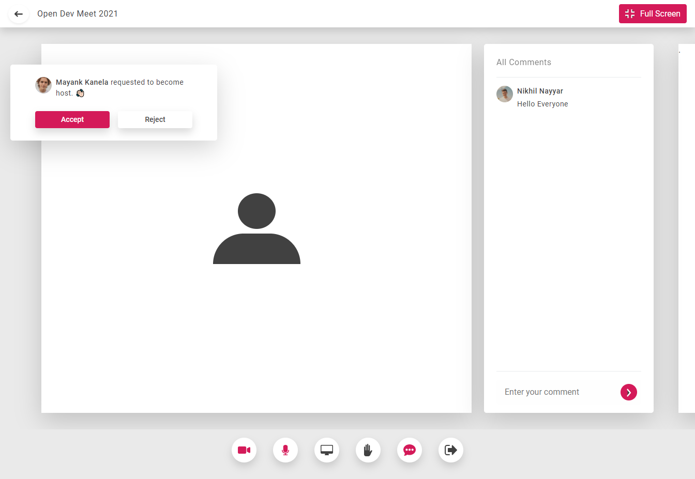

# Vue-App

[](LICENSE)




## Installing dependencies

* since **package-lock.json** file is in repo. One can use the following command to install dependencies:

    ```
    npm ci
    ```

* on occassions a developer should be responsible for updating dependencies using command:

    ```
    npm i
    ```

## Guides

[Project Configeration](guides/project-config.md)

[Styling](guides/styling.md)

[Application](guides/application.md)

[Components Detail](guides/components.md)

[Formatting](guides/formatting.md)

[Vue Cli](https://cli.vuejs.org/guide/) : Learn about public folder, bundler configeration, vue-cli-service etc here.

## Compiles and hot-reloads for development
```
npm run serve
```

## Compiles and minifies for production
```
npm run build
```

## Lints and fixes files
```
npm run lint
```
